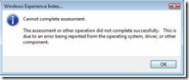

So I finally got my copy of Vista. It took a while, but that is another story. I’ve got Vista Ultimate and my PC is pretty new, I built it myself. Here are the specs that I think are important regarding the Vista install:

- Motherboard: ASUS P5ND2-SLI Socket 775
- Processor: Intel Pentium D 840 3.2 GHz (Dual Core)
- RAM: 1 Gig
- Video: EVGA GeForce 6200LE 128MB (OR SO I THOUGHT) You can probably guess where this is going.

Before I continue I should be clear. I am a programmer, not a systems guy. I can usually find my way with this stuff but I’m no expert with hardware, that is for sure.

**The Install**

I ran a Windows Vista Upgrade Advisor and I passed so I figured everything would be all cool (did I miss a warning or fine print somewhere? In hindsight, I wonder). I popped in the Vista DVD and proceeded. By the way, I was warned to stay away from the upgrade and just do a full install. So I did. Vista installed really quickly so I was excited. In 15 minutes or so I was up and running Vista…sort of.

**Windows Experience Index**

I played around for a few minutes, everything looked different then XP so I was pretty curious. And then I thought to myself, “Where is all that cool [Windows Aero](http://www.microsoft.com/windows/products/windowsvista/features/details/aero.mspx) stuff?” Hmmm, I am not getting the good stuff here. After some research on the web I found out how to check my Windows Experience Index (Control Panel > System and Maintenance > System. Then click the link for Windows Experience Index). I figured this test would inform me about my problem. Instead I got this error “Cannot complete assessment. The assessment or other operation did not complete successfully. This is due to an error being reported from the operating system, driver, or other component.”

Nice. You’d think they could have narrowed it down and told me why it didn’t work.

**Device Problems**

After checking my device manager, I found that there were 2 devices that Vista did not like. One was the SM Bus Controller. The second was “unknown device”. I called Asus. I was able to get some information from them and was told to check out the NVIDIA site to download the driver for the SM Bus (System Management Bus). After the install, I was down to the one unknown device. I found some information by viewing the details page of the the driver properties window. The hardware ID was ACPI\PNPB006. Thanks to the magic of google, I determined that this was probably a GamePort or MidiPort that is not supported anymore with Vista. So I disabled it via the BIOS. Now I have no bad devices. I was feeling proud of myself for getting this far so I re-ran the Windows Experience assessment and… get the same error. Nice. My ego was really not doing well at this point.

Since the error was rather vague, I spent some time upgrading various other drivers. I figured one would save the day. Upgrade a driver, run the assessment tool, upgrade a driver, run the tool. Yada yada yada, still no aero glass.

**Video Card**

I called EVGA. Turns out, my card does not have 128MB ram. The box said “Supports 128MB”. While I was on the phone with them I opened my PC to get the part number and found a tag that says 16MB on it. Uh oh, what is this? The guy on the phone could not explain to me why the box says “Supporting 128MB” or even what that means (pretty sad, huh). I later learned that it shares the some memory from the system but it doesn’t really have 128MB. The bottom line is that it does not have enough video memory for the advanced features of Vista.

Luckily, it is pretty easy to get hardware quickly. I hit [Tiger Direct](http://www.tigerdirect.com/) and ordered the card: **[XFX GeForce 7600 GS with 512MB DDR2](http://www.xfxforce.com/web/product/listConfigurationDetails.jspa?productConfigurationId=685597)**. My biggest worry was that I’d get the card and find out I had some other problem. Two days later the card was delivered and installed.

**My New Experience Index: 4.4**

(click to enlarge)

I wasn’t sure if I should be excited or not. I had it in my head that my rating would higher. But, this is enough to run all of the cool Aero Glass features of vista. Oddly enough, my cool new video card is the lowest scoring item. Do I need to increase my ranking? Supposedly a rating of 4 or higher is all I but now I admit I have rating envy.

**My Complaints/Lessons Learned**

In the end the fault was mine because my video card was lousy. But here is what bothers me: the error “Cannot complete assessment”. Why not? Why couldn’t Vista tell me what the problem is? Maybe not specifically, but why not tell me there is a problem with my video card or driver or something more specific. At least I learned enough to ask the right questions before buying a graphics card.

Did I mess with those device for nothing? Would it all have worked if I didn’t disable the GamePort? I guess it doesn’t matter and I learned a bit about devices from the experience.
